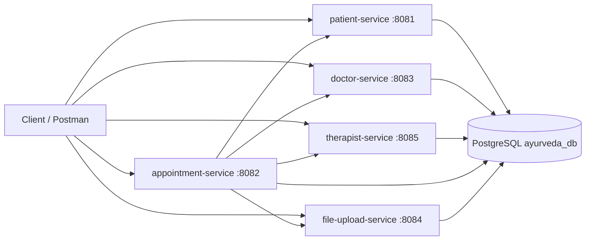

# Ayurvedaa API — Microservices

Multi-module Spring Boot backend for the Ayurvedaa clinic platform. The monolithic API was refactored into independent services that share a PostgreSQL database and communicate over HTTP.

## Tech Stack

| Layer | Technology |
|-------|------------|
| Runtime | Java 21 |
| Framework | Spring Boot 3.5.3 |
| Database | PostgreSQL |
| Migrations | Flyway |
| API docs | SpringDoc OpenAPI (Swagger UI) |
| Build | Maven (multi-module) |

## Architecture



## Modules

| Module | Port | Description |
|--------|------|-------------|
| `common-service` | — | Shared library: `ApiResponse`, exceptions, base entities, OpenAPI auto-config |
| `patient-service` | 8081 | Patient master data |
| `appointment-service` | 8082 | Appointments, medical assessments, doshas, therapies |
| `doctor-service` | 8083 | Doctor master (Step 1) |
| `file-upload-service` | 8084 | Appointment document uploads |
| `therapist-service` | 8085 | Therapist master (Step 2) |

## Prerequisites

- **JDK 21**
- **Maven 3.9+** (or use the included `./mvnw` wrapper)
- **PostgreSQL** database accessible from your machine

## Configuration

Each service reads database settings from `src/main/resources/application.yml`. For local or production use, override credentials via environment variables instead of committing secrets:

```yaml
spring:
  datasource:
    url: jdbc:postgresql://<host>:5432/ayurveda_db?currentSchema=public
    username: ${DB_USERNAME:ayurveda}
    password: ${DB_PASSWORD}
```

All services use the **`public`** schema. Flyway manages per-service migration history tables.

`appointment-service` also references peer services:

```yaml
services:
  patient:
    url: http://localhost:8081
  doctor:
    url: http://localhost:8083
  therapist:
    url: http://localhost:8085
  file-upload:
    url: http://localhost:8084
```

## Build

From the repository root:

```bash
# Windows
.\mvnw.cmd install -DskipTests

# Linux / macOS
./mvnw install -DskipTests
```

## Run

Start each service in a separate terminal (order matters for appointment flows — patient/doctor/therapist/file-upload should be up before appointment-service):

```bash
# Windows — example for patient-service
cd patient-service
..\mvnw.cmd spring-boot:run

# Linux / macOS
cd patient-service && ../mvnw spring-boot:run
```

Repeat for `doctor-service`, `therapist-service`, `file-upload-service`, and `appointment-service`.

## Swagger / API Documentation

Each runnable service exposes interactive API docs:

| Service | Swagger UI | OpenAPI JSON |
|---------|------------|--------------|
| Patient | http://localhost:8081/swagger-ui.html | http://localhost:8081/api-docs |
| Appointment | http://localhost:8082/swagger-ui.html | http://localhost:8082/api-docs |
| Doctor | http://localhost:8083/swagger-ui.html | http://localhost:8083/api-docs |
| File Upload | http://localhost:8084/swagger-ui.html | http://localhost:8084/api-docs |
| Therapist | http://localhost:8085/swagger-ui.html | http://localhost:8085/api-docs |

## API Overview

All endpoints are prefixed with `/api/v1`.

### Master data

| Service | Base path | Methods |
|---------|-----------|---------|
| Patient | `/patients` | `POST`, `GET`, `GET /{id}` |
| Doctor | `/doctors` | `POST`, `GET`, `GET /{id}` |
| Therapist | `/therapists` | `POST`, `GET`, `GET /{id}` |
| Dosha | `/doshas` | `POST`, `GET`, `GET /{id}` |

### Appointments & assessments (appointment-service)

| Resource | Base path |
|----------|-----------|
| Appointment booking | `/appointments` |
| Combined medical assessment | `/medical-assessment` |
| Ayurvedic assessment | `/ayurvedic-assessments` |
| Physical examination | `/physical-examinations` |
| Medical history | `/medical-histories` |
| Lifestyle information | `/lifestyle-information` |
| Systemic examination | `/systemic-examinations` |
| Treatment plan | `/treatment-plans` |
| Treatment categories | `/treatment-categories` |
| Therapies (master) | `/therapies` |
| Appointment therapies | `/appointment-therapies` |

### Documents (file-upload-service)

| Resource | Base path |
|----------|-----------|
| Appointment documents | `/documents` |

### Medical assessment endpoints

| Method | Path | Content-Type | Description |
|--------|------|--------------|-------------|
| `POST` | `/medical-assessment` | `application/json` | Save all 6 assessment sections in one request |
| `POST` | `/medical-assessment/with-documents` | `multipart/form-data` | Same as above plus optional file uploads |
| `GET` | `/medical-assessment/{bookingId}` | — | Fetch full assessment for a booking |

## Typical workflow

1. **Create doctor** — `POST /api/v1/doctors` (port 8083)
2. **Create therapist** — `POST /api/v1/therapists` (port 8085)
3. **Book appointment** — `POST /api/v1/appointments` (port 8082); creates/links patient via patient-service
4. **List doshas** — `GET /api/v1/doshas` (port 8082); use `doshaId` in ayurvedic assessment
5. **Save assessment** — either individual section APIs or `POST /api/v1/medical-assessment`

Sample JSON payloads are in the [`curl-samples/`](curl-samples/) folder.

### Example: create a doctor

```bash
curl -X POST http://localhost:8083/api/v1/doctors \
  -H "Content-Type: application/json" \
  -d @curl-samples/01-doctor.json
```

### Example: book an appointment

```bash
curl -X POST http://localhost:8082/api/v1/appointments \
  -H "Content-Type: application/json" \
  -d @curl-samples/03-appointment-booking.json
```

> **Note:** `consultationTypeIds` is a list of UUIDs from consultation type master (`GET /api/v1/consultation-types`).

## Project structure

```
ayurvedaa-services/
├── common-service/          # Shared library
├── patient-service/
├── doctor-service/
├── therapist-service/
├── appointment-service/     # Core booking & assessment logic
├── file-upload-service/
├── curl-samples/            # Example request bodies
├── db-init/                 # Optional DBA scripts
├── pom.xml                  # Parent POM
└── mvnw / mvnw.cmd          # Maven wrapper
```

## Database scripts

Optional scripts under [`db-init/`](db-init/) for schema grants and migration helpers. Application migrations live in each service under `src/main/resources/db/migration/`.

## Branch

This codebase targets the **`micro-service`** branch of [Ayurvedaa-API](https://github.com/styagi01Karnics/Ayurvedaa-API/tree/micro-service).

## License

Proprietary — Ayurvedaa
